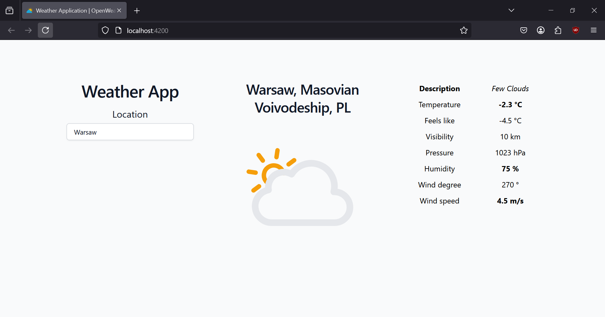
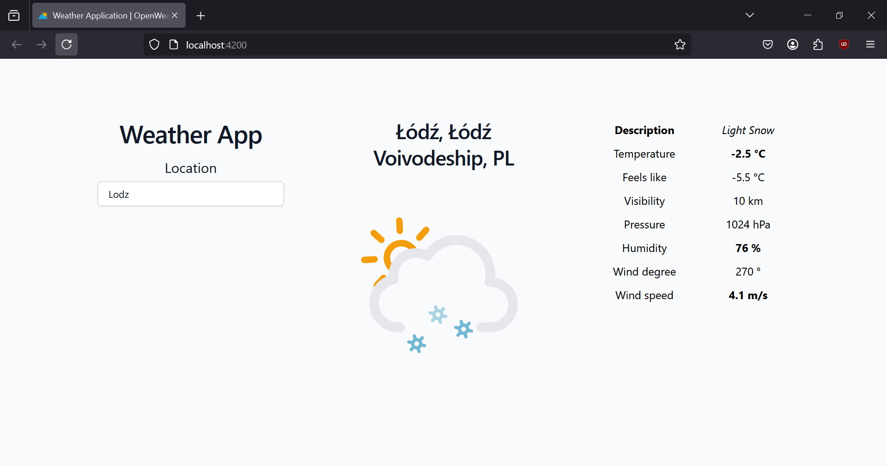

# Weather App

Weather Application written in Angular and Tailwind CSS.

## OpenWeatherMap

[OpenWeatherMap](https://openweathermap.org/api) API is used to retrieve weather data for a location of our choice.

## Services

- [GeoCoder API](http://api.openweathermap.org/geo/1.0/direct?): GET request is sent to find the coordinates in altitude and longitude for a desired location.
- [Weather API](https://api.openweathermap.org/data/2.5/weather?): GET request is sent to retrieve the weather data for the location of our choice.

## Presentation

| Few Clouds                                     | Light Snow                                   | 
|------------------------------------------------|----------------------------------------------|
|  |  |
